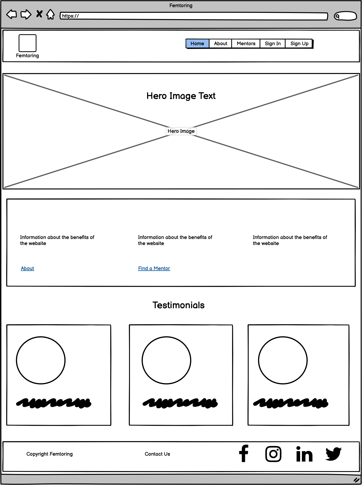
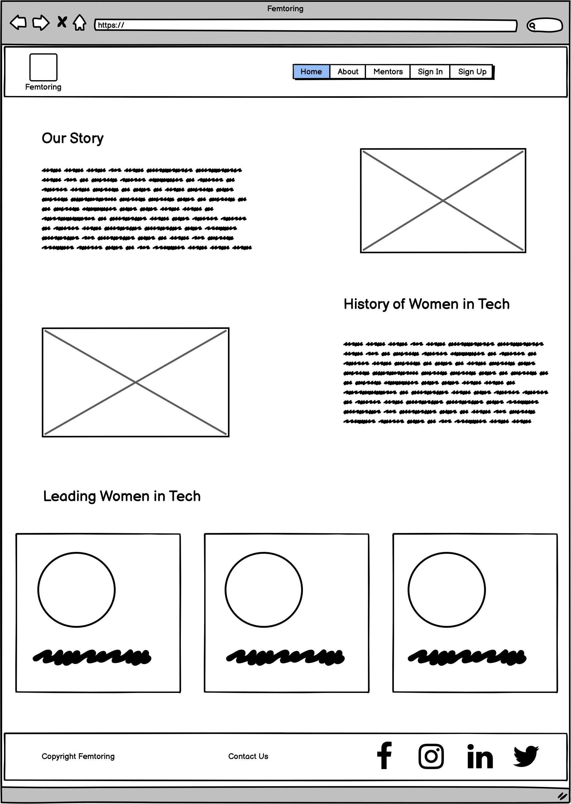
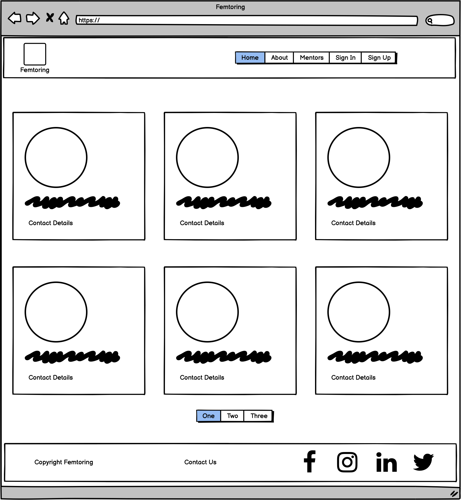

# Hackathon International Woman's Day - Women in Tech (Lack of representation)

This website represents a solution to a very common issue in the world, women's lack of representation. Its goal is to represent important women in tech, past and present, and to enable communication between them and women in tech so that the gap can be bridged.

This is done by creating a blog-type site where members can see the mentors, their achievements and where they work. Through this the user can log in as a mentor or user, and users can book an appointment and send a message to the mentor. 

## Audience:

This project is aimed specifically at women who are working in tech who want to speak to other women in tech who can offer knowledge and guidance. It's hoped that the information shared on the site
stresses the importance of mentorship and providing guidance for other women in tech.

## Wireframes:

These were created using Balsamiq, examples of the main pages below:

|  |
|:--:|
| <b>Home page wireframe</b>|

|  |
|:--:|
| <b>About us wireframe</b>|

|  |
|:--:|
| <b>Mentors page wireframe</b>|

## Features:

- Navigation bar: This is at the top of every bar. It allows the user to move between pages, sign up and login.

- Home page: Here you can find information on the website's goals and purpose, as well as links to the rest of the website. You can also see tesitmonials from users of the site.

- About page: This contains information on the website and the team behind it. There is also information on the history of women in tech and some examples of modern-day women tech leaders.

- Mentor's page: This contains the different profiles for the mentors, the user can click on them and go into each one of them.

- Mentor profiles: This is the page where the user can see the individual information on each mentor.

## Features left to implement:

    ADD THIS AT THE END

## Testing:

    ADD AT THE END

## Bugs:

    END

## Unsolved Bugs:

    END
## Validator testing:

    END

## Deployment:

This app is deployed on Heroku. The steps followed to deploy it are the following:
- Create a new app
- In the Settings page, navigate to: config var
- Add a PORT key and give it a value of 8000
- Add the link for Cloudinary, database and the secret key to Heroku Creds
- Navigate to the Deploy page
- Click on Enable Automatic Deploys
- Wait for your app to be built

The link for the live website can be found here: https://femtoring-team2.herokuapp.com/mentors/

## Credits:

## Media:

The images were all extracted from Google Images.

## Acknowledgements:
