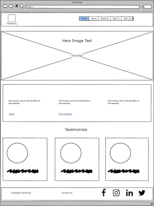
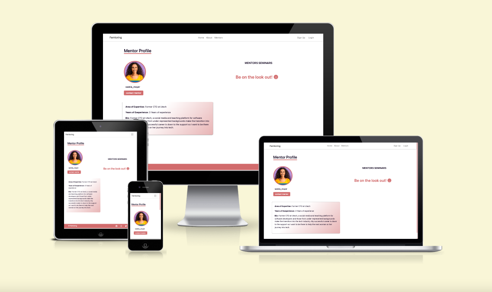

# Women in Tech (Lack of representation)

|  |
|:--:|
| <b>Femtoring</b>|

This website represents a solution to a very common issue in the world, women's lack of representation. Its goal is to represent important women in tech, past and present, and to enable communication between them and women in tech so that the gap can be bridged.

This is done by creating a portal-type site where members can see the mentors, their achievements and where they work. Through this the user can log in as a mentor or user, and users can book an appointment and send a message to the mentor. 

The link for the deployed site can be found here: https://femtoring.herokuapp.com

# Audience:

This project is aimed specifically at women who are working in tech who want to speak to other women in tech who can offer knowledge and guidance. It's hoped that the information shared on the site
stresses the importance of mentorship and providing guidance for other women in tech.

# Wireframes:

These were created using Balsamiq, examples of the main pages below:

|  |
|:--:|
| <b>Home page wireframe</b>|

|  |
|:--:|
| <b>About us wireframe</b>|

|  |
|:--:|
| <b>Mentors page wireframe</b>|

# Architecture
## Database
* A postgreSQL database offered by elephantSQL was the choice of database connected with the django framework during project development.
### Entities
* User
    * Allauth account formed the basis for creation of account. a standard account implemented with the program.
    * All auth provides a step by step documentation for successful installation. [Django All Auth](https://django-allauth.readthedocs.io/en/latest/installation.html "visit gosip")
    ``` bash
    pip3 install django-allauth
    ```
    and imported for use in django models.
    ```
    django.contrib.auth.models
    ```

# Features:

- Navigation bar: This is at the top of every bar. It allows the user to move between pages, sign up and login.

- Home page: Here you can find information on the website's goals and purpose, as well as links to the rest of the website. You can also see tesitmonials from users of the site.

|  |
|:--:|
| <b>Femtoring home page and nav bar</b>|

- About page: This contains information on the website and the team behind it. There is also information on the history of women in tech and some examples of modern-day women tech leaders.

|  |
|:--:|
| <b>Femtoring About page</b>|

- Mentor's page: This contains the different profiles for the mentors, the user can click on them and go into each one of them.

- Mentor profiles: This is the page where the user can see the individual information on each mentor.

- If any other user views mentor profile they can see seminars & events the mentor is involved in.

|  |
|:--:|
| <b>Mentor profile page</b>|

- Sign Up: Visitors to site can sign up as a mentor or a user seeking mentorship.

- Login: Visitors to site can log in if they have signed up already.

|  |
|:--:|
| <b>Femtoring Sign in page</b>|

|  |
|:--:|
| <b>Femtoring sign up page</b>|

- If Mentors are logged in they can view messages on their profile.

|  |
|:--:|
| <b>Mentor messages</b>|

- Contact Mentor: Users can choose a mentor and contact them to arrange a meeting. 

- Users must be logged in before they can contact mentor.


|  |
|:--:|
| <b>Femtoring sign up page</b>|

- 404 Page: if user navigates to page that doesn't exist 404 page comes up and presents link back to home.

|  |
|:--:|
| <b>Femtoring 404 page</b>|

# Testing:

## Manual Testing:
  - Manual testing was carried out on each feature manually, details in following table:

| Feature                                                                                        | Functioning            |
| :--------------------------------------------------------------------------------------------- | :--------------------: |
| Navigation Bar - all links direct user to correct site                                         |          Yes           |
| Navigation Bar - Nav list reduces to burger icon for small screens                             |          Yes           |
| Home page - contains info on site, working links around site and testimonials                  |          Yes           |
| Home page - all elements on home page are responsive to different screen sizes                 |          Yes           |
| About Page - contains info on motivations of site and influential women in tech                |          Yes           |
| About Page - all elements on about page are responsive to different screen sizes               |          Yes           |
| Mentor Page - contains profiles for different mentors with working links for each              |          Yes           |
| Sign Up - visitor to site can sign up as a mentor or someone seeking mentorship                |          Yes           |
| Login - visitor to site can sign in with valid credentials                                     |          Yes           |
| Mentor Profile - contains individual information on each mentor                                |          Yes           |
| Mentor Profile - when mentor logged in their messages are visible                              |          Yes           |
| Mentor Profile - when other user views profile seminars/events are visible                     |          Yes           |
| Contact Mentor - if user is logged in they can contact mentor                                  |          Yes           |
| Contact Mentor - user can send a message to mentor                                             |          Yes           |
| Mentor Profile - when other user views profile seminars/events are visible                     |          Yes           |
| 404 Page - if user gets lost on site 404 page is presented with working link back home         |          Yes           |

# Validator testing:

The pages of the website were run through [W3 HTML Validator](https://validator.w3.org/nu/#textarea "Link to W3 HTML checker main-page") from the source page.
The process for testing was going through each page of the website to check if they pass W3 HTML validation.
Errors detected in instances of duplicated `id` during population of items to template. Unable to read navbar list items on mobile screens and a ul  nested within another ulwhere removed.

| [html error](static/images/html-error-ul.png) |

| [html resolved](ADD IMAGE) |
|:--:|
| <b>W3 Validator resolution</b>|

# Mockups 

Landing Page
 

About Us Page


Mentors List Page


Profile Page


# Lighthouse 

Landing Page 


Mentors Page


Profile Page


# Bugs:

    There was an application error when deploying Heroku where the clause was unclear. The repository was deployed using a new url. 

## Unsolved Bugs:

    No unsolved bugs. 

# Deployment:

Before Deployment, It is important that in the django project settings, **Debug** is set to **False** majorly for the security of the project.
## Project Creation
To start this project, It is recommended to use the [template](https://github.com/Code-Institute-Org/gitpod-full-template "Link to Code Institute template") already created by Code Institute. By using this template, necessary plugins for your project are downloaded for you. After clicking this link, the following steps are to be followed.
1. Navigate to "Use this template" on the page.
    * click on the button
1. Navigate to "repostory name"
    * Enter a name for your repository to continue (e.g my-project)
    * You may enter a description for the project. (Not mandatory)
    * keep your repository checked "public" for assessment purposes.
    * Then click on the button "Create repository from template".
1. Are you registered with gitpod by now?
    1. If No ?
        * Visit the [Gitpod](https://www.gitpod.io "Click to visit gitpod") webiste and Login your details.
        * there after navigate back to Github and continue the steps after login.
    1. If yes ?
        * Navigate to the green button titled **Gitpod**
        * The creation of an environment might take a while. wait for gitpod to set up your environment.
        * It is important to pin your worksheet in Gitpod Dashboard and load subsequent opening of this project from the dashboard in order to keep all installed creds intact.
    1. Here we have Visual Studio code as IDE.
        * By default, on the left side-bar is the respository we created in github including an already made README.md file, package.json, requirements.txt and run.py etc.
            * A mouse right click in this panel area gives us option to create new files and or folders in this repository.
            * Finally, the bash terminal for interacting with github and writing our python code is located right below this window. We can right click on the terminal option to move terminal to right panel
        * To upload changes made in our repository to github in this IDE, the following commands are to be enetered after the $ sign in the bash terminal.
            * To check the status of your repository if any changes have been made.
                 ``` bash
                    git status
            *  To stage changes made
                ``` bash
                    git add .
            * To commit changes made
                ```bash
                    git commit -m "commit message in between this quotes"
            * To push changes made to github
                ```bash
                    git push
            * View files that have been uploaded to github
                ```bash
                    git ls-files
                ```


The link for the live website can be found here: https://femtoring.herokuapp.com


# Technologies
## Languages
* HTML
    * Hyper Text Markup Language(HTML) is the main text writer used for this website.
* CSS
    * Cascading Style Sheets(CSS) is the technology used for styling the website.
* [Javascript](https://www.javascript.com/ "Link to Javascript")
    * Javascript frontend programming language.
* [Python](https://www.python.org/ "Link to python")
    * Python is a programming language that lets you work quickly and integrate systems more effectively.
## Programs, Frameworks, Libraries
* [Django](https://docs.djangoproject.com/ "Link to Django Docs")
    * Django makes it easier to build better web apps more quickly and with less code.
* [Bootstrap](https://getbootstrap.com/ "Link to Bootstrap main-page")
    * A free and open-source CSS framework directed at responsive, mobile-first front-end web development.
* [Code Institute template](https://github.com/Code-Institute-Org/gitpod-full-template "Link to Gitpod-template")
    * A coding school for learning Software Development provides template for gitpod necessary libraries.
* [Github](https://github.com "Link to Github main-page")
    * Github is the site used for the deployment and hosting of this website.
* [Gitpod](https://www.gitpod.io "Link to Gitpod main-page")
    * Gitpod is the open-source developer platform used in tandem with github for the deployment of the website source code.
* [Visual Studio code](https://code.visualstudio.com "Link to visual studio code main-page")
    * The Integrated development environment(IDE) used for the writing of source code.
* [TinyJPG](https://tinyjpg.com/ "Link to TinyJPG main-page")
    * Website used for the compression of images used in the website.
* [Pexels](https://www.pexels.com "Link to pexels main-page")
    * Website used to source images used in the website.
* [Techsini](https://techsini.com/multi-mockup/index.php "Link to website main-page")
    * The Mock-up generator website used for creating the website mock-up image.
* [W3C CSS Validator](https://jigsaw.w3.org/css-validator/validator "Link to W3 CSS main-page")
    * CSS validator used to validate the website's CSS in comparison to standard CSS writing.
* [W3 HTML Checker](https://validator.w3.org/nu/#textarea "Link to W3 HTML main-page")
    * HTML validator used to validate the website's HTML in comparison to standard HTML writing.
* [Image resizer](https://imageresizer.com/resize/download/632541ad11b49d00123e785e "Link to main-page")
    * For resizing of images to desired output
* [AWS](https://aws.amazon.com/ "Link to AWS")
    * Provides cloud based images and video management services.
* [elephantSQL](https://www.elephantsql.com/ "Link to elephantSQL")
    * The postgreSQL Database used for the program.

# Credits:
Credits to Code Institute for the use of gitpod full template to start up the project
# Media:
Some Images used as mentors were a product of pexels and Unsplash
The images were all extracted from Google Images.

# Acknowledgements:
To the Squash bugs and eMerge triumphant Team for giving their best up till the last minute. Great work guys
